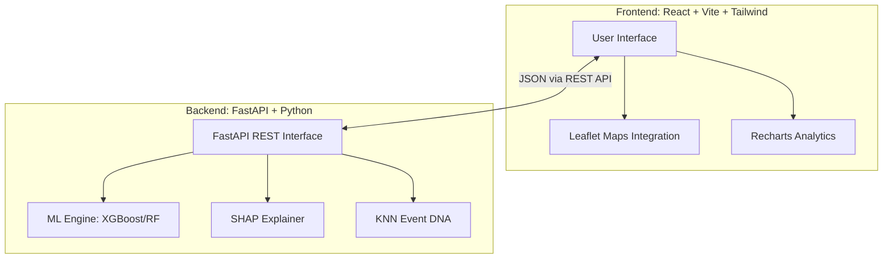

<div align="center">
  
  <h1>ASTRAM</h1>
  <p><strong>Adaptive Street Traffic Risk & Action Monitor</strong></p>
  <p>An advanced, AI-driven, full-stack intelligence platform designed for the Bengaluru Traffic Police to monitor, predict, and mitigate traffic disruptions in real-time.</p>

  <div>
    
    
    
    
    
  </div>
</div>

<br/>

## Overview

**ASTRAM** bridges the gap between reactive traffic management and proactive incident mitigation. By leveraging machine learning models trained on historical event data, ASTRAM predicts the duration and impact of traffic incidents, recommends optimal deployment strategies, and provides deep analytics into traffic patterns.

### ✨ Key Features
- 🔮 **Incident Prediction**: Predict duration, impact score, and severity of live traffic incidents.
- 🧬 **Event DNA**: Find and analyze similar historical incidents using KNN similarity matching to understand past resolution strategies.
- 📊 **Rich Analytics**: Comprehensive dashboards displaying corridor risk, junction risk, hourly distributions, and cascade events.
- 🧠 **Explainable AI (XAI)**: SHAP integration to provide transparency into *why* the model made a specific prediction.
- 👮 **Actionable Recommendations**: Automated deployment recommendations for traffic personnel based on incident severity and zone.
- 📡 **Real-time Drift Monitoring**: Tracks prediction drift and dynamically flags when models require retraining.

---

## 🏗️ System Architecture

ASTRAM is composed of a decoupled modern stack: a React/Vite frontend and a high-performance FastAPI/Python backend.



---

## 📂 Repository Structure

```text
Astram-Flipgrid/
├── backend/                  # FastAPI & Machine Learning Backend
│   ├── data/                 # Raw event dataset (8,173 records)
│   ├── ml/                   # ML pipeline (training, features, SHAP, KNN)
│   ├── models/               # Trained model artifacts
│   ├── routers/              # API endpoints (/predict, /recommend, etc.)
│   └── ...                   # Python scripts & config files
│
├── frontend/                 # React UI Application
│   ├── src/
│   │   ├── components/       # Reusable UI components
│   │   ├── pages/            # Views (EventDNA, Analytics, etc.)
│   │   └── ...
│   └── ...                   # Vite & Tailwind configuration files
│
└── README.md                 # You are here!
```

---

## 🚀 Getting Started

Follow these steps to run the application locally.

### 1️⃣ Starting the Backend
The backend runs on Python 3.11+ and uses FastAPI.

```bash
cd backend
pip install -r requirements.txt
uvicorn main:app --reload --port 8000
```
*The API will be live at `http://localhost:8000`*

### 2️⃣ Starting the Frontend
The frontend uses Node.js, Vite, React 19, and Tailwind CSS 4.

```bash
cd frontend
npm install
npm run dev
```
*The web interface will be live at `http://localhost:3000` (or the port Vite provides)*

---

## 🧠 Machine Learning Engine
ASTRAM's prediction core utilizes advanced ML techniques:
- **Algorithms:** Evaluates RandomForest, XGBoost, and LightGBM to select the most performant model.
- **Features Engineered:** Temporal (hour, day, weekend flags), Categorical (event_cause, corridor, zone), and Binary markers (road_closure, breakdown_reason).
- **Impact Scoring:** Custom weighted formula factoring in duration, closures, priority, and planning.

---

## 📜 License

Built for the ASTRAM hackathon. 
Released under the **MIT License**.
